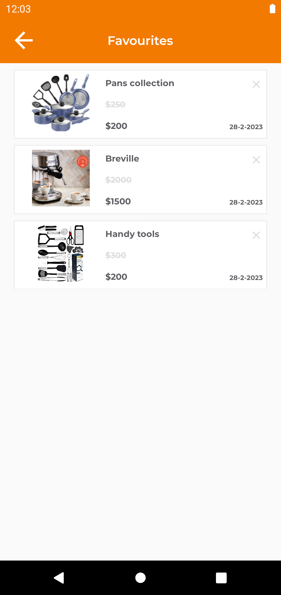
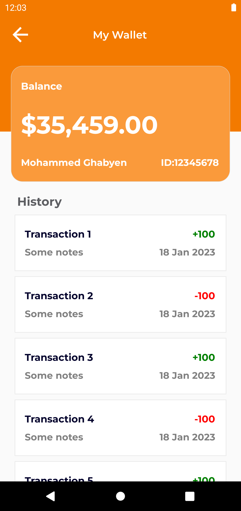
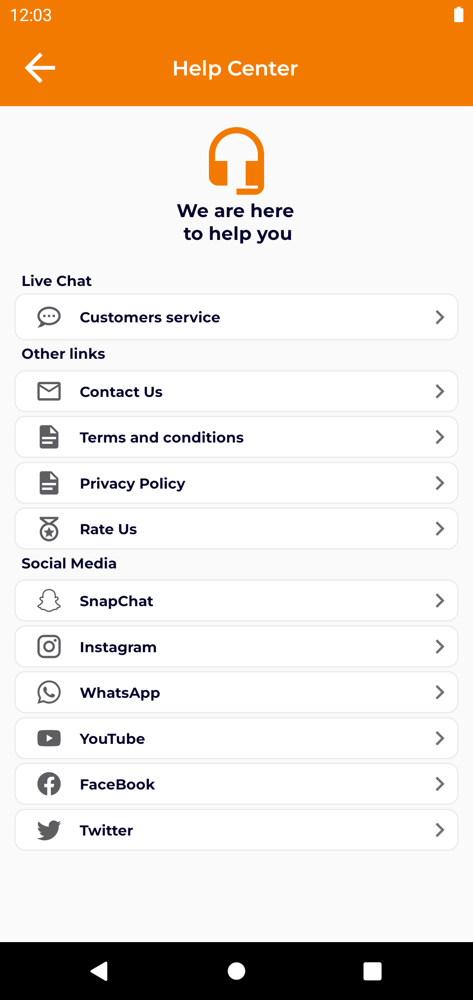

# Online Shop
* This is a mobile application sample that provides e-commerce services.
* This application is developed using React-Native.

## Google play & Appstore links:
  

### Photos of The Application

            

# You Can Do... 
### As User
* You can log in and create a new account.
* You can view products and brands.
* You can view the main and sub-sections.
* You can view product details.
* You can view the cart.
* You can pick a delivery location.
* You can view other app screens.

## Install
* you must have nodejs on your machine

## Run the React project
* 1 ) Download the React project.
* 2 ) Enter the React-Native project folder.
* 3 ) Run 'yarn install' from the command line.
* 4 ) Run 'react-native run-android' for android and 'react-native run-ios' for iOS from the command line.

## App direct download link
 * https://drive.google.com/file/d/1fp_rcZowr_LI28uHyIiGYLiKN4kLJ1Oa/view?usp=sharing
